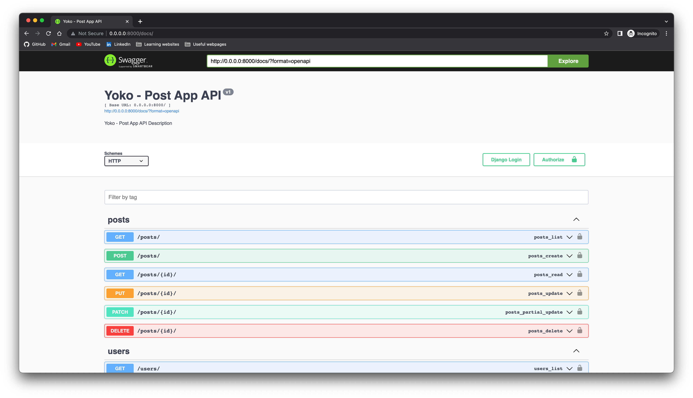

# Yoko - Technical Task

The backend part of the application for publishing posts, where posts are checked by moderators or administrators and then published to the post list



### Built with

[](https://www.djangoproject.com/)
[](https://www.postgresql.org/)
[](https://redis.io/)
[](https://docs.celeryq.dev/)
[](https://www.docker.com/)

## Getting started

### Prerequisites

If you want to run the server, the first step is installing [Django](https://www.docker.com/)

You can check if Docker is installed on your system by running the following command:

```bash
docker info
```

### Installation

1. Clone the repository

```bash
git clone https://github.com/yerenn22/yoko-post-app
```

2. Change directory to the repository
    
```bash
cd yoko-post-app
```

3. Run the application

```bash
docker-compose build
docker-compose up
```

### RESTful URLs

- [http://localhost:8000](http://localhost:8000) - the main page with the API root
- [http://localhost:8000/posts](http://localhost:8000/posts) - the page with the list of posts
- [http://localhost:8000/users](http://localhost:8000/users) - the page with the list of users
- [http://localhost:8000/admin](http://localhost:8000/admin) - the page with the list of posts

### Contact

- [Telegram](https://t.me/yerenn22)
- [GitHub](https://github.com/yerenn22)
